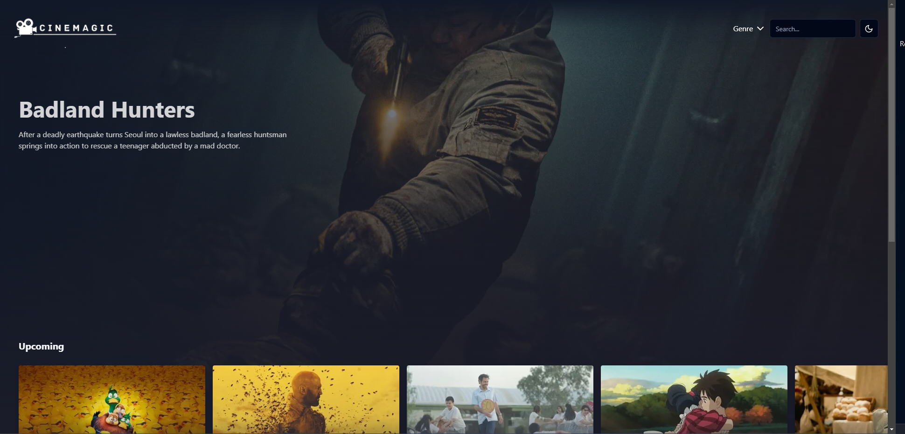
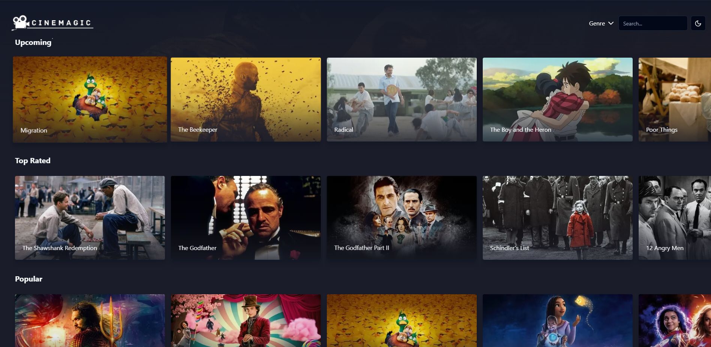
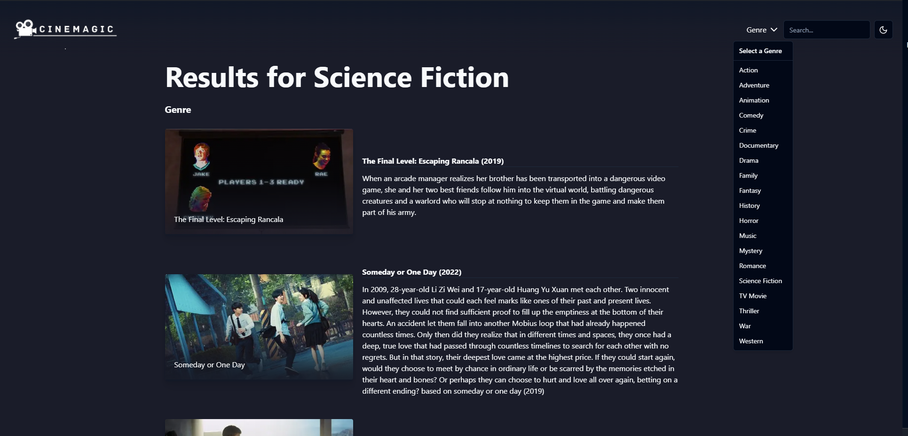
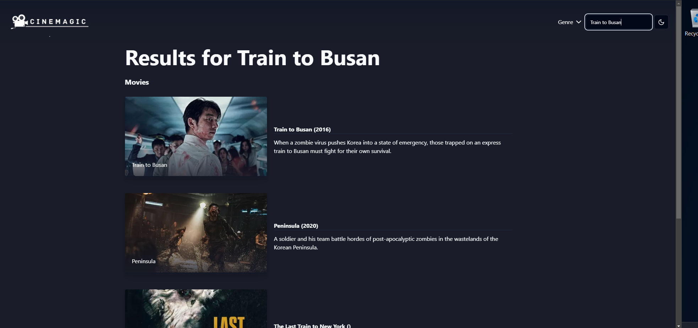

# 🎥 Cinemagic

Discover movies!

## ✨ Getting Started

1. Clone this project
2. Run `npm i` in the terminal to install all dependencies for your project.
3. Create a `.env.local` file in the project directory and add the TMDB API Read Access Token to it.
4. Finally, run `npm run dev` in your terminal to start the server.

## ⚙️ Tech Stack

1. React
2. TMDB
3. ShadCN
4. TS
5. Tailwind

## 📸 Screenshots

### 🏠 Home Page

### 📃 Genres

### 🔍 Search

